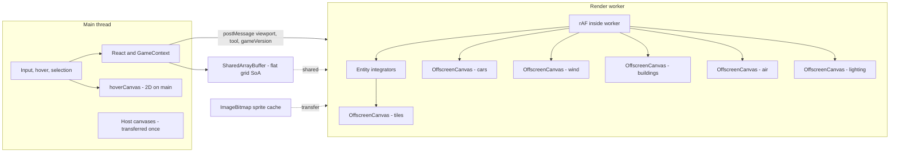

## Scope

- Target: **IsoCity only**. IsoCoaster untouched in this upgrade.
- Language: **No Rust/Wasm**. Pure TypeScript refactor.
- Goal: eliminate main-thread contention from draws/animation, and eliminate `Tile[][]` GC/allocation pressure in simulation/scan passes.
- Non-goal: WebGL/WebGPU migration, framerate ceiling changes, simulation logic changes, save format rewrite (adapter-based compat).

## Current architecture (relevant bits)

- Seven stacked `HTMLCanvasElement`s in [src/components/game/CanvasIsometricGrid.tsx](src/components/game/CanvasIsometricGrid.tsx) lines 170-176: `canvas` (tiles), `hover`, `cars`, `wind`, `buildings`, `air`, `lighting`.
- Main paint rAF effect near line 1062; animated entities rAF effect near line 2510 (updates + draws cars, buses, peds, trains, aircraft, boats, barges, fireworks, smog, clouds, wind).
- Hover is already a dedicated canvas (`hoverCanvasRef`, line 171, cleared/drawn near line 2305).
- Grid is `Tile[][]` in [src/games/isocity/types/game.ts](src/games/isocity/types/game.ts) line 152; `Tile` shape at lines 97-108.
- `simulateTick` in [src/lib/simulation.ts](src/lib/simulation.ts) runs on `setInterval` from [src/context/GameContext.tsx](src/context/GameContext.tsx); clones tile rows via `getModifiableTile`.
- Sprites loaded as `HTMLImageElement` in [src/components/game/imageLoader.ts](src/components/game/imageLoader.ts) with an in-memory Map cache. WebP-preferred, optional background-color filter.
- Existing perf groundwork in [src/lib/performanceUtils.ts](src/lib/performanceUtils.ts): `SpatialGrid`, `ChunkRenderer`, `getVisibleTileBounds`, `FrameBudget`, `LOD_LEVELS`. Not all of it is used by the main tile walk today - Phase 2 can reuse `getVisibleTileBounds` / `ChunkRenderer` against the flat grid.

## Expected outcomes (and non-outcomes)

- **Phase 1 delivers responsiveness**: input latency, pan/zoom smoothness, hover feel, and UI thread freedom during heavy frames. Main-thread work during a sustained pan should drop to ~0 (aside from hover redraw).
- **Phase 1 does not raise the framerate ceiling on packed maps.** On very large cities the paint cost is dominated by `ctx.drawImage` call count and sprite decoding, not by the JS orchestrating them. Moving the same Canvas 2D draws into a worker removes contention with the UI thread but does not make each draw faster. Expect steadier frames, not higher peak FPS.
- **If peak FPS on packed maps becomes the next priority**, the follow-on is batched sprite rendering via WebGL or WebGPU (texture atlas + instanced quads). That is explicitly a future Phase 3, not part of this plan.
- **Phase 2 delivers tick-cost and GC wins**, plus it unlocks a future Rust/Wasm port of `simulateTick` / pathfinding. Once the grid is flat, crossing the JS-Wasm boundary with zero-copy views becomes practical; while the grid is `Tile[][]`, Rust is not worth it.

## Target architecture

## Phase 1 - OffscreenCanvas render worker

### 1.1 New files

- `src/workers/renderWorker.ts` - worker entry, owns all `OffscreenCanvas` contexts and the two rAF loops (paint + animated).
- `src/workers/renderWorkerManager.ts` - main-thread wrapper (mirrors pattern of [src/lib/saveWorkerManager.ts](src/lib/saveWorkerManager.ts)). API: `init(canvases, gridBuffer, spriteAtlas)`, `updateViewport`, `updateTool`, `notifyGridVersion`, `setSpeed`, `terminate`.
- `src/workers/renderProtocol.ts` - typed message union for main - worker traffic.

### 1.2 Sprite pipeline refactor

- Extend [src/components/game/imageLoader.ts](src/components/game/imageLoader.ts) with a second code path that returns `ImageBitmap` (via `createImageBitmap(blob)` from `fetch`), keyed identically.
- Port `filterBackgroundColor` (line 129) to operate on an `OffscreenCanvas` 2D context so it also works inside the worker. Today it uses `document.createElement('canvas')` and `canvas.toDataURL()` which do not work in a worker.
- Main thread loads atlases once as `ImageBitmap`s, `postMessage`s them to the worker (transferable, zero-copy).

### 1.3 Canvas ownership transfer

- In [src/components/game/CanvasIsometricGrid.tsx](src/components/game/CanvasIsometricGrid.tsx): on mount, call `canvasRef.current.transferControlToOffscreen()` for all six worker-owned canvases (everything except `hoverCanvasRef`). Transfer the six `OffscreenCanvas` handles to the worker.
- Keep `hoverCanvasRef` on the main thread - hover/selection feedback stays instant, no postMessage round-trip. Existing code near line 2305 continues to draw there unchanged.
- Pointer/keyboard/wheel handlers stay on the main thread; they call `renderWorkerManager.updateViewport({ offset, zoom, hoveredTile, selectedTool })` on change.

### 1.4 Move render code into the worker

Move these modules into worker-callable functions (they already take `ctx` as a param, so the port is mostly about imports):
- Paint loop body currently at [src/components/game/CanvasIsometricGrid.tsx](src/components/game/CanvasIsometricGrid.tsx) ~1062-2300 (tile walk, queue fills, `insertionSortByDepth`, draw queues).
- Animated loop body at ~2510 end-of-file (updates + draws for cars, buses, peds, trains, aircraft, boats, barges, effects, wind).
- Draw helpers: [src/components/game/drawing.ts](src/components/game/drawing.ts), [src/components/game/drawPedestrians.ts](src/components/game/drawPedestrians.ts), [src/components/game/drawAircraft.ts](src/components/game/drawAircraft.ts), [src/components/game/roadDrawing.ts](src/components/game/roadDrawing.ts), [src/components/game/bridgeDrawing.ts](src/components/game/bridgeDrawing.ts), [src/components/game/railSystem.ts](src/components/game/railSystem.ts) draw helpers, [src/components/game/placeholders.ts](src/components/game/placeholders.ts).
- Entity updaters: [src/components/game/vehicleSystems.ts](src/components/game/vehicleSystems.ts), [src/components/game/pedestrianSystem.ts](src/components/game/pedestrianSystem.ts), [src/components/game/trainSystem.ts](src/components/game/trainSystem.ts), [src/components/game/aircraftSystems.ts](src/components/game/aircraftSystems.ts), [src/components/game/boatSystem.ts](src/components/game/boatSystem.ts), [src/components/game/bargeSystem.ts](src/components/game/bargeSystem.ts), [src/components/game/seaplaneSystem.ts](src/components/game/seaplaneSystem.ts), [src/components/game/effectsSystems.ts](src/components/game/effectsSystems.ts), [src/components/game/windSystem.ts](src/components/game/windSystem.ts), [src/components/game/lightingSystem.ts](src/components/game/lightingSystem.ts).
- These modules must become framework-free - strip any `useEffect`/`useRef`/React hooks, return plain state objects the worker owns. The existing `useVehicleSystems`/`useAircraftSystems` hooks on the main thread get replaced by worker-side state owned by `renderWorker.ts`.

### 1.5 Refactor hooks out

The current code wraps updaters in hooks (`useVehicleSystems`, `useBargeSystem`, `useEffectsSystems`, `useWindSystem`). Split each into:
- Pure `create*State()` + `update*()` + `draw*()` functions (no React) - worker uses these.
- Thin React hook retained only if something needs main-thread state (most do not).

### 1.6 MiniMap and lighting

- [src/components/game/MiniMap.tsx](src/components/game/MiniMap.tsx) stays on main thread; reads from the shared grid buffer (Phase 2) or from a debounced `postMessage` snapshot.
- `useLightingSystem` ([src/components/game/lightingSystem.ts](src/components/game/lightingSystem.ts)) moves to worker; its canvas becomes an `OffscreenCanvas`.

### 1.7 Fallback

- Detect `HTMLCanvasElement.prototype.transferControlToOffscreen` at runtime. If missing (rare in 2026 but possible in older WebViews), fall back to the existing main-thread renderer unchanged. Gate via `src/workers/renderSupport.ts`.

### Phase 1 acceptance

- No visible behavior change. Click/drag/zoom/hover feel at least as responsive. Main-thread `performance.now` sampling around input handlers shows zero paint work during pans.
- All seven canvases render correctly; hover is still pixel-perfect; minimap updates.
- Save/load unchanged.

## Phase 2 - Flat typed-array grid (SoA)

### 2.1 Schema design

New file `src/games/isocity/gridBuffer.ts` defining the SoA layout. One `ArrayBuffer` (or `SharedArrayBuffer` where cross-origin-isolated) with parallel typed-array views indexed by `idx = y * width + x`:

- `zone: Uint8Array` - enum index
- `buildingType: Uint8Array` - enum index (0 = none)
- `buildingLevel: Uint8Array`
- `buildingFlags: Uint8Array` - powered, watered, abandoned, onFire, etc. (bitfield)
- `buildingRotation: Uint8Array`
- `roadMask: Uint8Array` - 4-bit N/E/S/W connectivity
- `railMask: Uint8Array`
- `landValue: Uint8Array`
- `pollution: Uint8Array`
- `crime: Uint8Array`
- `traffic: Uint8Array`
- `misc: Uint8Array` - hasSubway, hasRailOverlay, water/beach flags (bitfield)

Variable-size per-building state (e.g. building-specific sub-state, animation timers) kept in a sparse `Map<number, BuildingExtra>` keyed by tile index. Most tiles have no extra.

Total hot footprint: ~12 bytes/tile. A 200x200 city is 480 KB - trivially scannable every tick.

### 2.2 Adapter layer

- `src/games/isocity/gridAdapter.ts`: `getTile(idx): Tile` returns an object-shaped view reconstructed on demand from the SoA buffer, for code paths that still want the old `Tile` interface. Write path `setTileField(idx, field, value)` mutates the buffer in place.
- Migrate [src/lib/simulation.ts](src/lib/simulation.ts) to read/write via direct typed-array indexing - eliminates `getModifiableTile` row cloning (current per-tick hot allocation).
- `calculateServiceCoverage`, `calculateStats`, airplane population scan ([src/components/game/aircraftSystems.ts](src/components/game/aircraftSystems.ts) ~88-92), `isIntersection` cache ([src/components/game/vehicleSystems.ts](src/components/game/vehicleSystems.ts) ~906-928), and the diagonal tile walk in [src/components/game/CanvasIsometricGrid.tsx](src/components/game/CanvasIsometricGrid.tsx) all switch to integer-indexed typed-array reads.

### 2.3 Versioning and invalidation

- Keep existing `gameVersion`, `structureVersion`, `roadNetworkVersion` integers (already in `GameState`). Bump on writes. Worker reads integers via a small `Int32Array` header region in the same buffer - lock-free, `Atomics.load` when SAB is available.

### 2.4 Save/load compatibility

- [src/lib/isocityStorage.ts](src/lib/isocityStorage.ts), [src/lib/saveWorker.ts](src/lib/saveWorker.ts), [src/lib/saveWorkerManager.ts](src/lib/saveWorkerManager.ts): add `serializeFromBuffer` / `deserializeToBuffer` that translate between the SoA buffer and the existing JSON `Tile[][]` save format. Old saves keep loading; new saves preserve the on-disk schema.

### 2.5 Cross-origin isolation note

- `SharedArrayBuffer` requires COOP/COEP headers. Check/update [next.config.js](next.config.js). If enabling COOP/COEP breaks third-party embeds, fall back to a plain `ArrayBuffer` plus a once-per-frame `postMessage` of a `Uint8Array` view (still cheap - ~500 KB).

### Phase 2 acceptance

- `simulateTick` on a 120x120 city shows large reduction in allocation count (Chrome DevTools allocation timeline), and p99 tick time drops measurably.
- No visible behavior change. Saves load across phase boundary.
- Minimap and stats still update correctly.

## Sequencing and risk

- Phase 1 and Phase 2 are independent and can ship separately. Ship Phase 1 first; it is the bigger perceived-responsiveness win and does not touch game logic.
- Highest-risk item in Phase 1: the sprite-filter path (`filterBackgroundColor`) and main-thread assumptions baked into entity-update hooks. Budget time for a careful de-hooking pass.
- Highest-risk item in Phase 2: silently diverging behavior from subtle `Tile` object identity / clone semantics in `simulateTick`. Mitigation: write a golden-state test - run N ticks on the old code and the new code from the same save and diff the outputs.

## Explicit non-decisions for this plan

- **No WebGL/WebGPU migration.** Parked as an optional future Phase 3 if packed-map peak FPS becomes the priority. Phase 1's worker structure is compatible with a later swap to a WebGL/WebGPU renderer (same message protocol, different backend).
- **No Rust/Wasm.** Parked as an optional future phase after Phase 2, when the flat grid makes zero-copy FFI practical. Best targets at that point would be `simulateTick`, `calculateServiceCoverage`, and the BFS pathfinders in [src/components/game/utils.ts](src/components/game/utils.ts) and [src/components/game/railSystem.ts](src/components/game/railSystem.ts).
- No multiplayer or networking changes.
- IsoCoaster is not migrated. The extracted pure update/draw functions are structured so that IsoCoaster can adopt them later without changes to IsoCity.